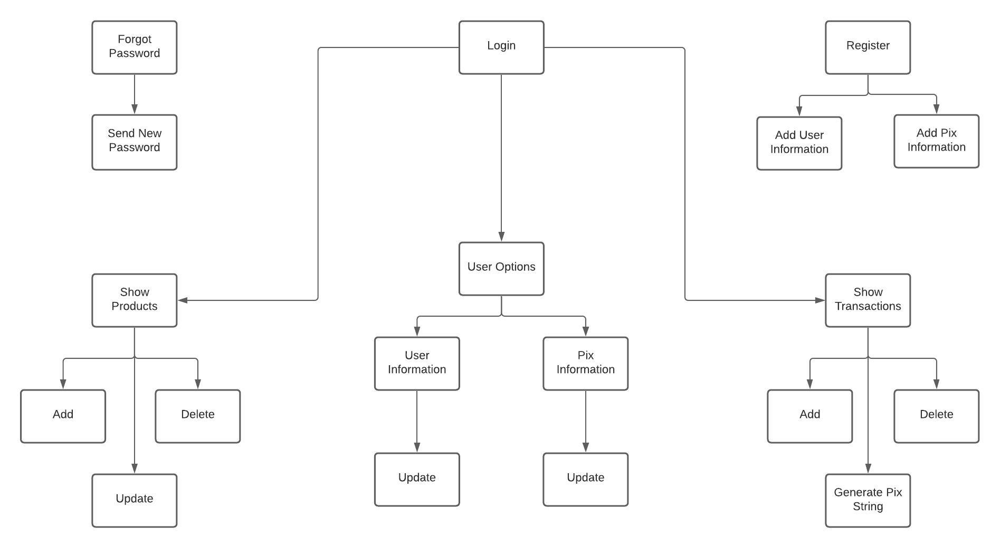

# Inventory Control and Payment System

In this project my intention is to make an app for the small trader can control the inventory and at the checkout, read the barcode, sum the values and finalize the payment. Payment will be made by pix.

Routes:


## Setup
Clone the project
```
git clone https://github.com/vmotta8/inventory-clean-api.git
```

Install dependencies
```
inventory-control % npm install
```

Complete the .env file
```
SECRET_MD5=
MONGO_URL=
```

## Routes
  - ```/users/register``` POST
    - Route for user registration: ```{
      name: 'My Name'
      email: 'myemail@email.com',
      password: '123456'
    }```

  - ```/users/authentication``` GET
    - Route for user authentication: ```{
      email: 'myemail@email.com',
      password: '123456'
    }```

  - ```/users/forgot_password``` POST
    - Route to send an email with a new password: ```{
      email: 'myemail@email.com'
      }```

  - ```/pix/register``` POST
    - Bearer Token will be required
    - Route to save pix information: ```{
      key: 'myemail@email.com',
      name: 'my name',
      city: 'my city'
      }```

  - ```/pix/generate_string``` GET
    - Bearer Token will be required
    - Route to generate a pix static string for use in qr code, the string will be generated according to the users pix data and was made for purchases with BRL: ```{
      value: 15.5
      }```
